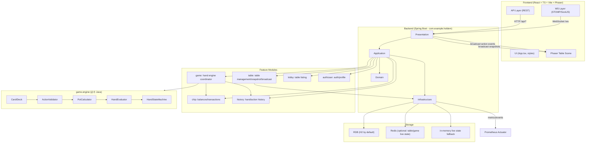
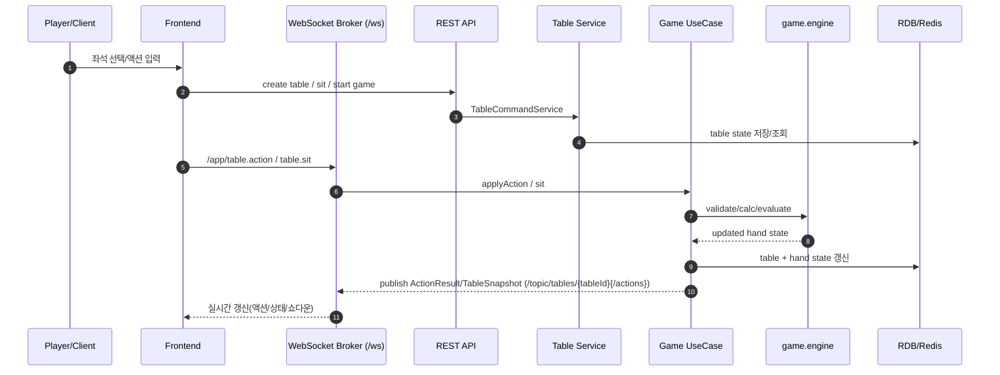

# Texas Hold'em Poker Project (Spring Boot + React + TypeScript + Vite + Phaser)

실시간 텍사스 홀덤 게임 백엔드/프론트 데모 프로젝트입니다.  
백엔드는 게임 규칙 엔진(`game.engine`)과 실시간 테이블 운영(`table`)을 분리한 feature 기반 아키텍처로 구성되어 있고, 프론트는 React + TypeScript + Vite + Phaser로
테이블 UI와 카드/액션 이력을 시각화합니다.

## 주요 목표

- 테이블 운영/게임 규칙/칩/기록을 분리한 구조 설계
- 실시간 WebSocket 기반 라운드 진행
- 봇 플레이어(전략별) 참여 및 자동 액션 처리
- 핸드 진행 로그/쇼다운 결과/액션 히스토리 노출
- 올인/사이드팟/쇼다운 판정 등 주요 포커 규칙 지원

## 기술 스택

- Backend: Java 17, Spring Boot 4, Spring WebMVC, Spring Security, Spring WebSocket/STOMP, JPA, Redis, Flyway, H2 (기본)
- Frontend: React 18, TypeScript, Vite, Phaser 3, STOMP/SockJS
- DB: 기본 H2 인메모리, MySQL 연동 옵션 존재

## 프로젝트 구조

패키지는 feature 단위로 구성되어 있습니다.

```text
src/main/java/com/example/holdem
├─ auth
├─ user
├─ lobby
├─ table
├─ game
├─ chip
├─ history
├─ admin
└─ common
```

각 feature는 기본적으로 다음 레이어를 가집니다.

- `presentation`: Controller, WebSocket Handler, DTO
- `application`: UseCase/Service
- `domain`: 핵심 도메인 모델
- `infrastructure`: Repository, Redis/JPA 퍼시스턴스

`game/engine`은 프레임워크 의존을 최대한 배제한 순수 Java 로직으로 구성되어 있습니다.

## 현재 핵심 기능

- 테이블
  - 최대 11명 좌석 지원
  - 좌석 생성/조회, 좌석 입장(WS/REST), 진행 상태 전파
- 게임
  - 핸드 시작, 플레이어 액션(FOLD/CHECK/CALL/RAISE), 턴 진행
  - 라운드(Preflop / Flop / Turn / River / Showdown) 자동 전이
  - 올인/사이드팟/쇼다운 정산 처리
- 봇
  - 게임 시작 시 봇 동시 참여
  - 전략별 액션(공격/보수/트래피 스타일) 및 지연 시간(think delay) 적용
- 프론트 UX
  - 테이블/보드 카드 렌더링(Phaser), 카드 이미지 표시
  - 각 라운드 액션 이력(누가 무엇을 얼마를 했는지)
  - 쇼다운 결과(승자/조합/카드) 표시
  - 현재 사용자 좌석/턴/게임 상태 배지
- 기록
  - action history 및 hand history 저장 구조

## 실행 방법

요구사항:
- Java 17
- Node.js 18+
- (선택) MySQL 8+ 또는 9+

### 1) 백엔드 실행

```bash
cd /Users/shurikim/IdeaProjects/PokerProject
./gradlew bootRun
```

기본 동작은 H2 인메모리 DB를 사용하며 Flyway가 비활성화되어 있습니다(`spring.flyway.enabled=false`).

애플리케이션 실행 시 기본 포트는 Spring Boot 기본값(8080) 기준입니다.

### 아키텍처 구성도





### 2) 프론트 실행

```bash
cd /Users/shurikim/IdeaProjects/PokerProject/frontend
npm install
npm run dev
```

Vite 기본 포트(5173)에서 실행됩니다.

## API 개요

### HTTP (REST)

- `GET /api/v1/lobby/tables` : 대기 테이블 목록
- `POST /api/v1/tables` : 테이블 생성 (`maxSeatCount` 포함)
- `GET /api/v1/tables` : 전체 테이블 조회
- `GET /api/v1/tables/{tableId}` : 테이블 단건 조회
- `POST /api/v1/tables/{tableId}/sit` : 좌석 입장
- `POST /api/v1/games/tables/{tableId}/start` : 핸드 시작  
  - `withBot`, `botCount`, `userId` 파라미터 사용 가능
- `GET /api/v1/games/tables/{tableId}` : 현재 핸드 상태 조회
- `GET /api/v1/histories/ping`, `GET /api/v1/admin/health` : 점검용 엔드포인트

### WebSocket (STOMP)

- 연결: `ws://{host}:{port}/ws`
- 구독 예시
  - `/topic/tables/{tableId}` : 테이블 스냅샷
  - `/topic/tables/{tableId}/actions` : 액션 결과 이벤트
- 전송 목적지
  - `/app/table.sit` : 좌석 입장
  - `/app/table.action` : 게임 액션 전송
  - `/app/table.leave` : 좌석 퇴장

## 설정 파일

- `src/main/resources/application.properties`
  - `spring.application.name=holdem`
  - `spring.datasource.url=jdbc:h2:mem:holdem;MODE=MySQL;...`
  - `spring.flyway.enabled=false`(기본값)
  - `spring.docker.compose.enabled=false`
  - `spring.session.store-type=none`, `holdem.redis.enabled=false`
  - `management.endpoints.web.exposure.include=health,info,metrics,prometheus`
  - `holdem.game.auto-next-hand.enabled=true` (자동 핸드 전개)

## 마이그레이션 참고

현재 `src/main/resources/db/migration/V1__create_user.sql`이 존재합니다.
기본적으로 H2 기반으로 동작하므로 별도 DB 설정 없이 실행 가능합니다.

MySQL 사용 시:
- `application.properties`의 datasource/driver를 MySQL로 변경
- 필요 시 `spring.flyway.enabled=true` 및 MySQL 문법 호환을 확인

## 폴더 구조 (프론트)

```text
frontend/src
├─ components
│  ├─ PhaserTable.tsx
│  └─ PokerCard.tsx
├─ phaser
│  └─ TableScene.ts
├─ lib
│  ├─ api.ts
│  └─ ws.ts
├─ types
│  └─ api.ts
├─ App.tsx
├─ main.tsx
└─ styles.css
```

## 운영/확장 참고

- 보안/권한: 기본 SecurityConfig 기반, 사용자 식별용 header 기반 인증 흐름을 사용합니다.
- 상태 저장: 테이블/게임 실시간 상태는 Redis를 우선 사용하도록 설계되어 있으며, 현재 설정에서 Redis를 끄고 동작할 수 있게 구성되어 있습니다.
- 향후 확장: 로그/메트릭, Redis 영속화 강화, MySQL 정식 운영 DB 전환, 클라이언트 브랜딩(폰트/테마/사운드), 봇 전략 커스터마이징 API 분리

## 자주 묻는 질문

- 프론트가 안 보이면 먼저 백엔드가 실행 중인지 확인합니다.
- 게임 시작 버튼이 안 보이는 경우: 좌석 입장이 완료되지 않았거나 WebSocket이 연결되지 않은 상태일 수 있습니다.
- 400 에러(`핸드를 시작하기 위한 플레이어 수가 부족합니다`)는 최소 플레이어 수 조건 미충족 시 발생합니다.
- DB 연결이 갑자기 실패하면 `application.properties`의 datasource와 드라이버 설정, Flyway/compose 설정을 우선 점검합니다.
